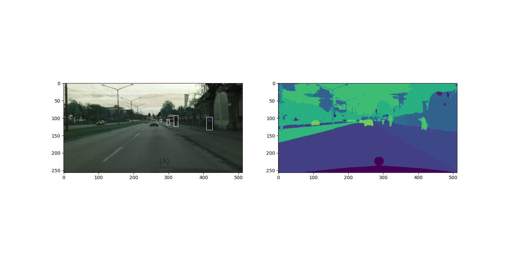
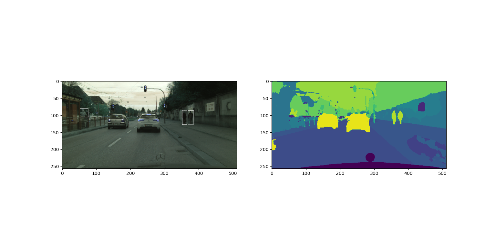
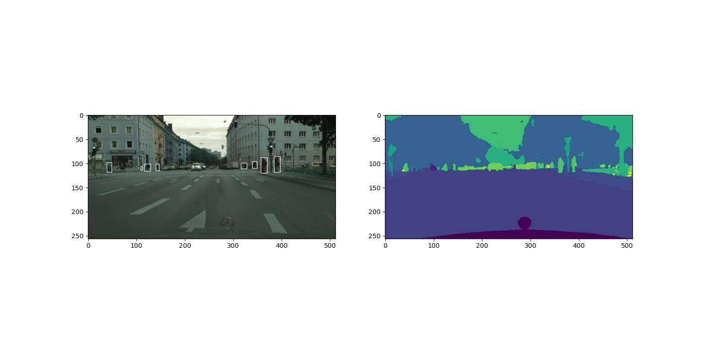
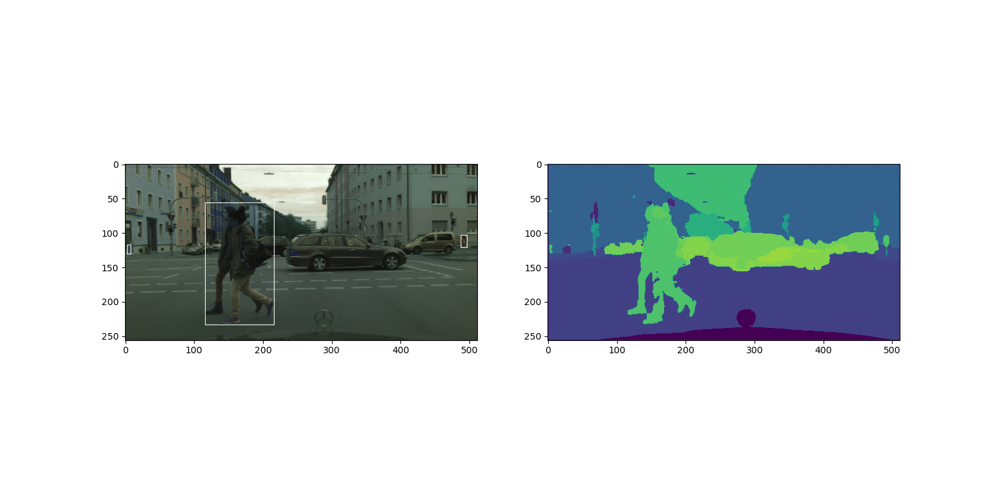
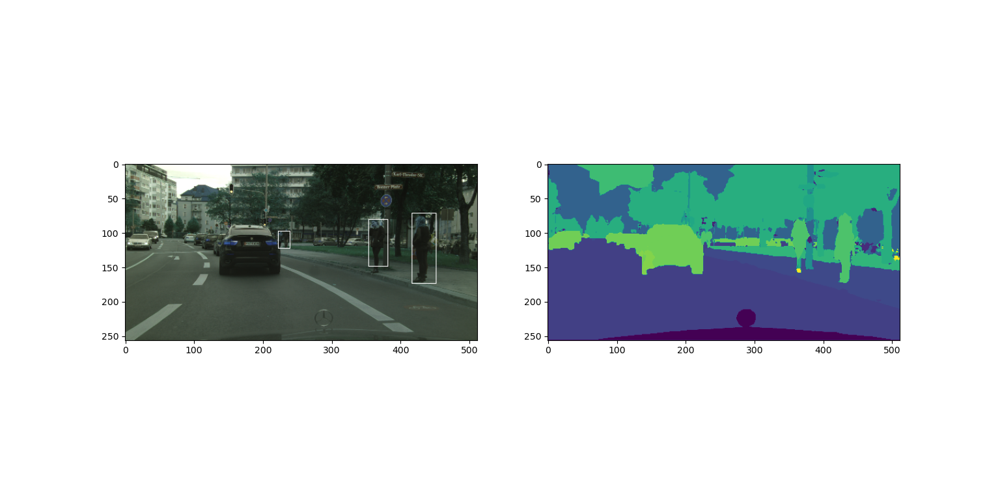

#### 运行方法

> 配置train.py 中路径和超参数后运行train.py即可，训练参数结果会保存在checkpoints文件夹中（没有的话会自己创建）。训练结束运行recognize.py，导入之前训练的参数，即可查看在Cityscape测试集上的结果。

#### 一些说明

> Cityscape数据集在预处理时被分成了20类（把train ID=255）的类也算进去了，这是一个失误，本来应该把train ID=255和train ID=-1的一起当成背景。这个错误出在utils/dataset.py的函数IdTrans2TrainID（）中，有时间我会更改后重新上传。

#### 实验结果

{:height="50%" width="50%"}

{:height="50%" width="50%"}

{:height="50%" width="50%"}

{:height="50%" width="50%"}

{:height="50%" width="50%"}

{:height="50%" width="50%"}
