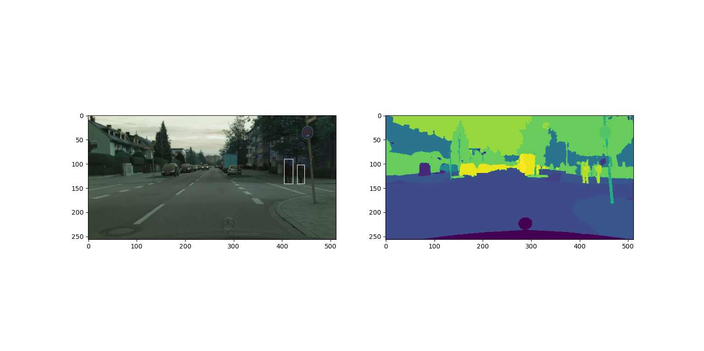

#### 运行方法

> 配置train.py 中路径和超参数后运行train.py即可，训练参数结果会保存在checkpoints文件夹中（没有的话会自己创建）。训练结束运行recognize.py，导入之前训练的参数，即可查看在Cityscape测试集上的结果。

#### 一些说明

> 预处理时把Cityscape数据集的前景分成了20类（包括train ID=255），用原始的Unet进行训练。

#### 实验结果

